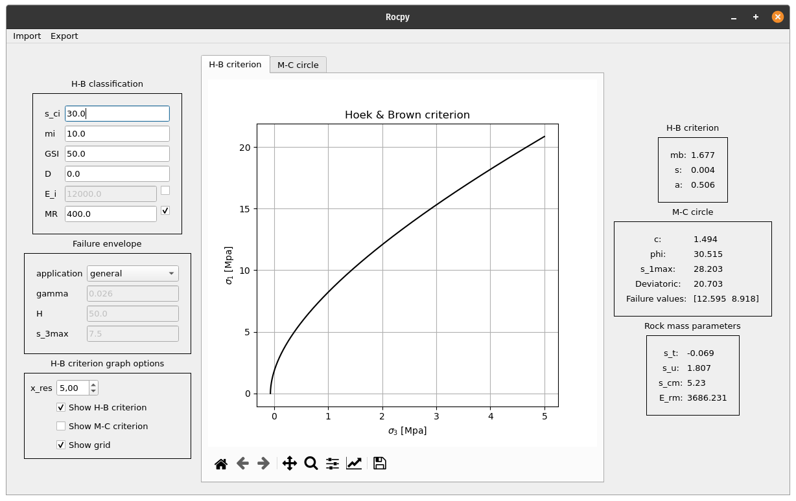
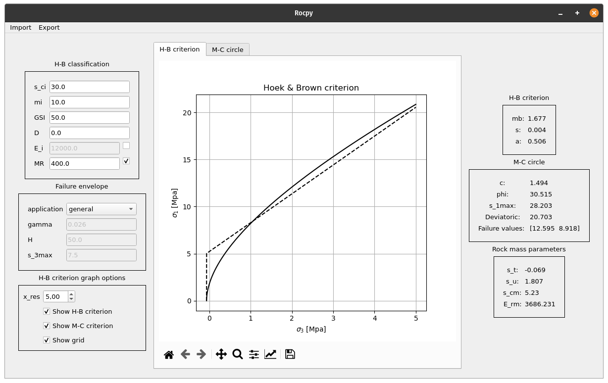
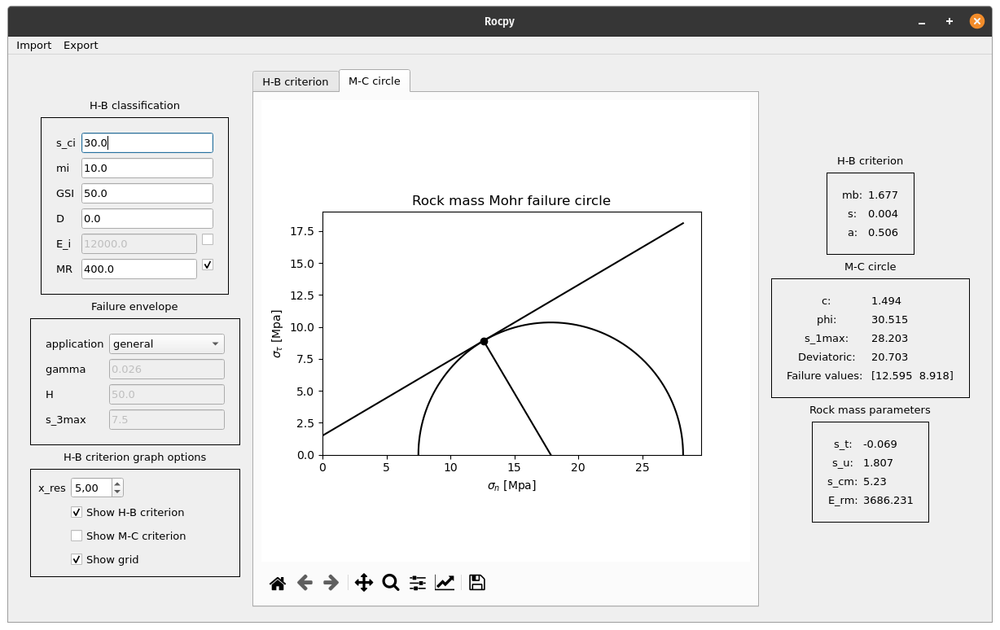

# Rocpy

RocLab inspired software written in Python.

RocLab is a very useful piece of free software written in 2011 for determining rock mass strength parameters, based on the generalized Hoek-Brown failure criterion (Hoek
et al. 2002). The main problem is that it is discontinued and the only version is available for windows. With this project I want to archive the same objective as RocLab's using python to increase the overall accessibility of the program and improve the plots' interfaces (thanks to matplotlib). 


## Functions

The available functions are:

+ Calculate Hoek-Brown criterion parameters
+ Calculate Rock mass parameters (σ_t, σ_c, σ_cm, E_rm)
+ Calculate σ_3max based on different applications (e.g tunnels)
+ Calculate Mohr-Coulomb parameters (c and φ)
+ Plot H-B and M-C envelope.
+ Failure mohr circle plot and σ_1max value.








## Dipendencies:

+ Numpy:

```python
pip install numpy
```


## Todo list


+ Tabulated values for input parameters (e.g. **D** or **mi**)
+ Import and export data


